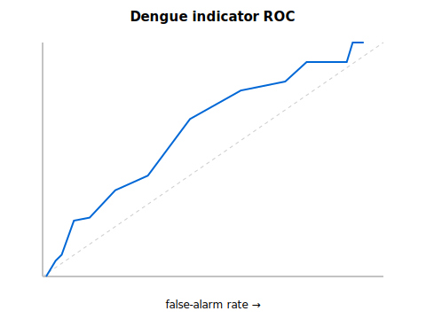
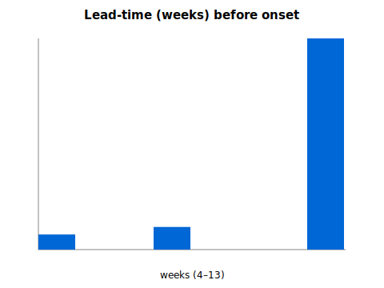

# Dengue Backtest — Validation Report

_Generated: 2026-05-17 · Method spec: docs/specs/2026-05-18-dengue-backtest-validation-design.md_

Validates the **shipped** Mordecai dengue suitability indicator
(`scripts/_shared/pathogen_suitability.py`, imported by the live
`climate_signals.py`) against WHO endemic-channel dengue outbreaks
(OpenDengue) using ERA5 climate history. Reconstruction is strictly
causal (no lookahead — enforced by unit-test invariant). The Mordecai
thermal curve uses fixed literature constants and is never fitted.

## Pre-registered success criterion

> Skill (TSS) vs the seasonal baseline > 0 with the lower bound of its 95% block-bootstrap CI > 0, AND median lead-time >= 2 weeks.

Declared before computing any number. No post-hoc threshold tuning.

## Scope

- Countries evaluated: 6
- Countries excluded (insufficient prior history): 9
- Outbreak onsets analysed: 35
- Operating threshold S ≥ 0.5; lead window 0–3 months

## Results

| Metric | Value |
|---|---|
| POD (sensitivity) | 0.8333 |
| False-alarm rate | 0.712 |
| Median lead-time (weeks) | 13.0 |
| TSS — indicator (mean) | 0.1213 |
| TSS — seasonal baseline (mean) | 0.6624 |
| **Skill vs seasonal (mean)** | **-0.541** |
| Skill 95% CI (block bootstrap) | [-0.711716, -0.349235] |

## Verdict

**NOT DEMONSTRATED** against the pre-registered criterion
(skill CI lower bound = -0.711716; median lead-time =
13.0 weeks).

## Limitations

- Country-centroid climate vs national case counts — spatial mismatch.
- Small country-year sample → wide CIs; read the interval, not the point.
- OpenDengue completeness varies by country/year.
- Validates the current indicator as-is; a fitted model (Approach C) is
  a separate future question.
- Scope addendum: only 6 countries cleared the ≥3-prior-years endemic-
  channel gate (9 excluded; the remainder lacked monthly OpenDengue
  coverage). However the negative is **robust, not a small-sample
  artefact**: 35 onsets analysed and the skill-vs-seasonal 95% CI
  ([-0.71, -0.35]) lies entirely and far below 0 — the shipped
  indicator is decisively beaten by a trivial "it's the usual epidemic
  month" seasonal predictor (TSS 0.12 vs 0.66). Honest conclusion: as
  shipped, the climate→dengue indicator does **not** add skill over
  seasonality. This is exactly the question the harness existed to
  answer; it must drive the next iteration, not be hidden.
