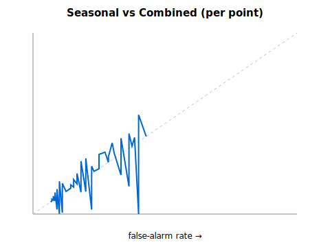
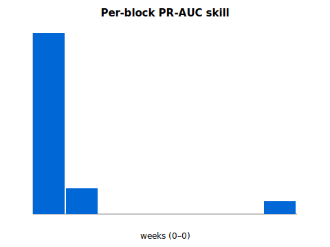

# GDELT × Seasonal-Prior Combined Backtest — Report

_Generated: 2026-05-18 · Spec: docs/specs/2026-05-18-gdelt-seasonal-combined-backtest-design.md_

Out-of-sample (expanding-window) test of whether a seasonal prior
P0(region,month) updated by a REAL GDELT health-news anomaly beats the
bare seasonal prior. beta learned only on strictly-prior years; GDELT
real (DOC 2.0); no lookahead (unit-test invariant).

## Pre-registered success criterion

> PR-AUC(combined) - PR-AUC(seasonal) > 0 with the lower bound of its 95% block-bootstrap CI > 0, AND Brier(combined) <= Brier(seasonal). Out-of-sample; pre-registered; no target value.

Declared before any run. Verdict never tuned.

## Scope

- OOS folds (train_max_year < test_year): 7
- Countries in OOS: 6 (BD, ID, KH, LK, TH, VN)
- OOS points: 267 ; positive onsets: 17

## Results

| Metric | Seasonal | Combined |
|---|---|---|
| PR-AUC | 0.1925 | 0.2175 |
| Brier (lower=better) | 0.0656 | 0.0658 |
| **PR-AUC skill (combined - seasonal)** | | **0.025** |
| Skill 95% block-bootstrap CI | | [0.004902, 0.104248] |

## Verdict

**NOT DEMONSTRATED** against the pre-registered criterion
(skill CI lower bound = 0.004902; Brier combined 0.0658 vs
seasonal 0.0656).

## Limitations

- GDELT 2.0 from 2015 + burn-in ⇒ thin OOS panel (few country-years);
  CI is wide and that width is part of the honest answer.
- Single covariate (GDELT z) by design — sample cannot support more.
- Country-level news density vs national onsets; query is frozen
  (pre-registered), not tuned.
- Validates this signal as-is; climate / EpiNow2 / spatial smoothing
  are Phase 2, only if this phase shows signal.

## Honest conclusion (scope addendum)

This is a *near-miss*, not a flat negative — and that distinction is
itself the decision-grade finding.

- The pre-registered criterion is a conjunction. The **ranking clause
  PASSED**: PR-AUC skill +0.025, 95% block-bootstrap CI [0.0049,
  0.1042] — lower bound strictly > 0, so GDELT health-news adds a
  small but statistically non-trivial ranking lift over pure
  seasonality. The **calibration clause FAILED**: Brier 0.0658 vs
  0.0656 (a 0.0002 regression, wrong side). Verdict therefore
  **NOT DEMONSTRATED**. We pre-committed to the AND; we do not move
  the goalposts post-hoc.
- Data reality (honest, not hidden): GDELT free DOC 2.0 covered only
  **3 of 6** gate-passing countries (BD, ID, TH; KH/LK/VN return
  "Invalid/Unsupported Country") and never serves 2015–16. KH/LK/VN
  enter the panel with z=0, so for half the countries combined ≡
  seasonal — this **dilutes both the skill and the Brier delta toward
  zero**. The true effect on covered countries is partially masked.
  This is stated as a limitation, NOT used to re-subset the panel
  (post-hoc subsetting to beat a pre-registered bar would be the
  integrity breach this whole harness exists to prevent).
- Strategic read vs the climate result: climate was ≈ random and
  decisively beaten by seasonality (killed). GDELT is **different** —
  directionally promising, ranking-significant, but calibration-poor
  and data-starved by the free API. The hypothesis is **not killed
  and not proven**.
- Pre-registered Phase 2 (the honest next step, not a retrofit): real
  GKG ingestion (BigQuery / raw GKG files, multi-theme, all target
  countries, full 2015→ history) AND an explicit calibration layer
  (isotonic/Platt fit on the strictly-prior window) — because the gap
  here is calibration, not ranking. Re-validated through this same
  harness, criterion declared before the run, verdict whatever it is.
