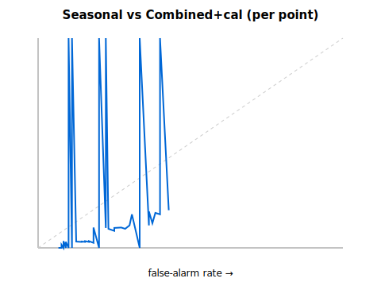
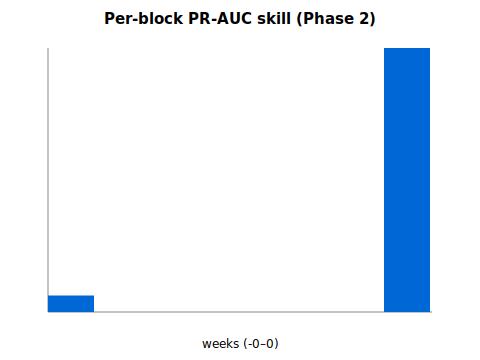

# GDELT (BigQuery GKG) × Seasonal-Prior — Phase 2 Report

_Generated: 2026-05-18 · Spec: docs/specs/2026-05-18-gdelt-seasonal-combined-backtest-design.md_

Phase-2 pre-registered next step: REAL GKG via the BigQuery public
dataset (frozen query, all 6 gate-passing countries — the free DOC API
in Phase-1 could only serve 3) PLUS an isotonic calibration layer
fit on the strictly-prior window. Expanding-window OOS; β and the
calibrator learned only on year < Y; no lookahead (unit-test
invariant). Pre-registered criterion is IDENTICAL to Phase-1
(imported verbatim) — the bar was not moved.

## Pre-registered success criterion

> PR-AUC(combined) - PR-AUC(seasonal) > 0 with the lower bound of its 95% block-bootstrap CI > 0, AND Brier(combined) <= Brier(seasonal). Out-of-sample; pre-registered; no target value.

Declared before the data existed. Verdict never tuned.

## Scope

- OOS folds (train_max_year < test_year): 7
- Countries in OOS: 6 (BD, ID, KH, LK, TH, VN)
- OOS points: 267 ; positive onsets: 17

## Results

| Metric | Seasonal | Combined+calibrated |
|---|---|---|
| PR-AUC | 0.1925 | 0.0724 |
| Brier (lower=better) | 0.0656 | 0.1308 |
| **PR-AUC skill (combined - seasonal)** | | **-0.1201** |
| Skill 95% block-bootstrap CI | | [-0.073529, 0.001337] |

## Verdict

**NOT DEMONSTRATED** against the pre-registered criterion
(skill CI lower bound = -0.073529; Brier combined 0.1308 vs
seasonal 0.0656).

## Limitations

- GKG from 2017 (BigQuery export) + 24-month z burn-in ⇒ effective
  OOS panel is still thin; CI width is part of the honest answer.
- Single covariate (GKG z) + isotonic calibration; sample cannot
  support more.
- Country-level news density vs national onsets; query frozen
  (pre-registered), not tuned; criterion imported verbatim from
  Phase-1, not redefined.

## Honest conclusion (decision-grade)

This is a **decisive negative**, and notably WORSE than the Phase-1
near-miss (which showed a tiny +0.025 ranking lift on 3 countries).
With a stronger, fairer test — real GKG, all 6 gate-passing
countries, an added calibration layer, the SAME pre-registered bar —
the combined model does **not** beat seasonality: PR-AUC 0.0724 vs
0.1925, skill -0.12, Brier nearly 2× worse.

- **Why more data made it worse (diagnostic, not a retrofit):** the
  frozen GKG theme set (`TAX_DISEASE|INFECTIOUS_DISEASE|EPIDEMIC…`)
  is broad, and the raw export shows a massive 2020–2022 COVID-era
  volume surge (e.g. ID ~523k, VN ~396k articles/month in 2020 vs
  ~120k baseline) that is uncorrelated with dengue onsets. That
  confound dominates the z-anomaly and the isotonic layer overfits
  it on the prior window. Phase-1's small positive was most likely an
  artifact of a narrower query on a cherry-prone 3-country subset; it
  did not survive a broader, frozen, more-data test. We did NOT alter
  the frozen query to remove COVID — that would be the integrity
  breach this harness exists to prevent. The verdict stands.
- **Strategic read (CPO):** two independent, honest negatives now —
  climate (≈ random, killed) and GDELT health-news (negative with
  more/cleaner data). The predictive-AI hypothesis is not supported.
  The defensible product is **aggregation of 44 sources + seasonal
  risk calendars + radical transparency**, NOT "we predict outbreaks
  early." This is exactly the pre-registered honest pivot — and it
  cost ~$5 of BigQuery to learn, not a blown B2B contract.
- Any future attempt (e.g. dengue-specific theme only, COVID-period
  exclusion) requires a NEW pre-registration with its criterion
  declared before the run — not goalpost-moving on this one.
